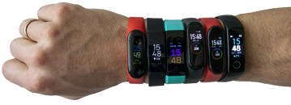

# Internet-Controlled Treat Dispenser
  
## What
Use a value in a Google Sheet to trigger an arduino to do something.  
  
  
## Why
Are you motivated by your fitness tracker to actually go out and take 10000 steps? *Me neither!*  
  

What if you were rewarded with a treat if your previous day's step count reached 10000? That's more motivating, isn't it!  
  
  
I want my tracker to trigger a device that can tempt me with treats, without me needing to do anything! It should work automatically.  
  
  
## How
You're probably wondering how do you get a signal from a tracker to an arduino. *I'm so glad you asked!*  
  
  
  
### 1. Export
If you have a **Fitbit**: you could export the data.  
If you have a **Garmin** like me: it's not so easy. Garmin doesn't let you make exports.  
Garmin users need to use a 3rd party app to export the data. For Android: try Health Sync.  
  
  
### 2. Import to Google Sheets
After your data is exported, follow this tutorial to get your data into a Google sheet.  
https://ithoughthecamewithyou.com/post/export-google-fit-daily-steps-to-a-google-sheet  
  
Note:  
1. You need a free Google account, such as gmail.  
2. You will need to copy and paste some code. Depending on which metric you want to be the trigger, (eg. steps, weight, distance) you may need to modify the code.  
  
  
  
### 3. Arduino Import to Google Sheets
Your Arduino Uno cannot connect to the internet yet. You need to use a breakout board with a Wifi connection, such as the ESP8266.  
  
  
*(WIP i'm still doing this part)*  

