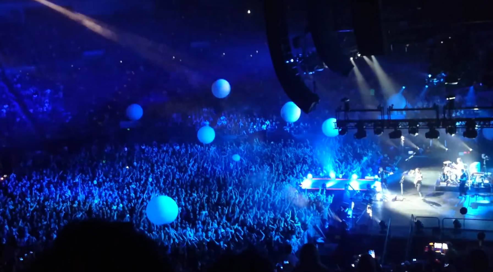
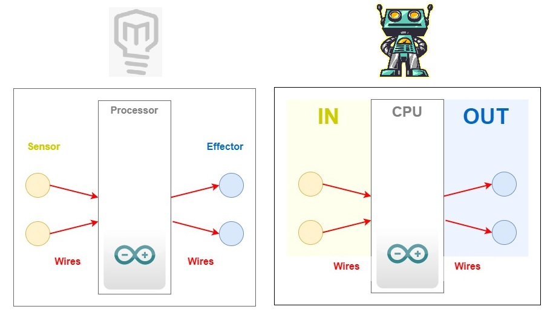
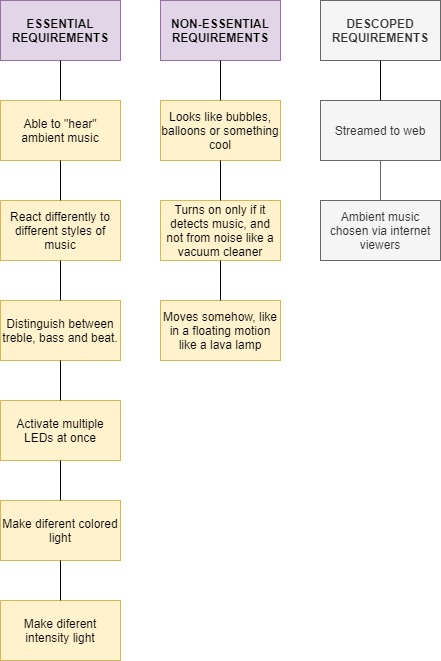
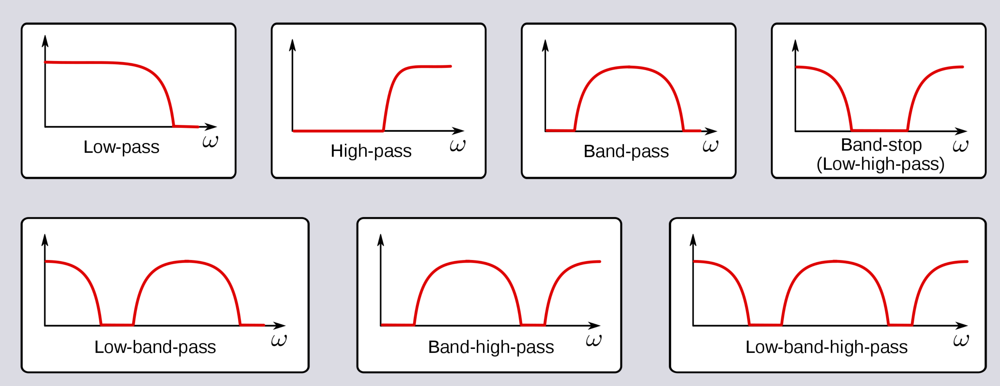
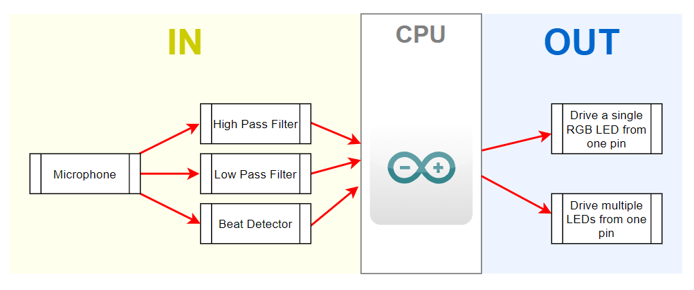

# Rock Concert in your Living Room
  

### Short Description
Light display that reacts to ambient music.  
  

### Project Justification
I love music. Due to the pandemic lockdown, I can't enjoy music with my friends right now. This project will create a device that brings some concert atmosphere into my living room.  
  

### Gear (WIP)
* Arduino
* color-changing LEDs
* ping pong balls
* maybe: microphone(s), filter(s)
  

## Brainstorm
I came up with a few interesting project ideas during the brainstorm phase, some of which I might create in the future. For now I settled on the rock concert idea. Quincy the Lab Assistant seemed to agree with this decision.  
I also thought of a crazy project to make a hamster-controlled canvas painting device, but it will take more than 10 days to train Quincy to walk on tiny pressure plates, so you'll have to wait a few months to see that one.  
  

For posterity, here is the whole list of project ideas.  
  
  

## Terminology
In the training course Mark talks about sensors and effectors, which is fine but it's easy to get big words confused. From now on I will refer to these things as "IN" and "OUT".  
  
  

## Initial Design
The inital design idea is pretty basic: music goes in, and lights come out.  
  
  

## Requirements & Revised Design
The requirements are all based on the constraints of input (music) and output (light). My lab assistant snacked on dried vegetables while I prioritized the requirements.  
  
As you can see I already descoped some of the requirements. "Descope" means they will not be included in the project.  
  
Now that I have my requirements, I can put more detail into the design. Since the project needs to detect different frequencies of sound, it will be necessary to set up multiple filters. I want it to look like the balloons at the rock concert, therefore I will put the LEDs inside pingpong balls. I also removed the requirement for movement, as that will be too complicated to do in a short timeframe.  
  
  

## Research & some thoughts
#### Thoughts
This is my first Arduino build. I'm impressed with the idea of modular design. If you could make a generic code framework and build up a library of separate input and output modules, then you could swap them in and out as desired.  
*Eg. There's one base "sketch". Load the "highpass audio filter" library and the "room light sensor" library and assign them to pins. Hooray your inputs are coded.*  
I won't have time to code a framework during this short course. It's something I should do later because it will save time and reduce complexity in future projects.  
  
#### Filters
Audio filters let some sound through, and filter out specific frequencies of sound. A low-pass filter lets low sound through, a high-pass filter lets high through, and a band-pass lets a section of frequencies through.  
  
*Source: Wikipedia https://en.wikipedia.org/wiki/Filter_(signal_processing)  
I would like to build 4 different circuits:
 * high pass filter
 * band bass filter
 * low pass filter
 * beat detector
This works out nicely because there are 12 x digital output pins on the Arduino UNO, and I need 3 x signal pins per group of color-changing LEDs.  
  
Filters in electronic circuits can be passive or active. I'm still figuring this out but in the short term passive filters are simpler so I will try that approach.  
  

## Prototype
I've decided on 7 different modules which require testing and prototyping separately, for contingency. Then if I can't get the parts on time or if I can't get them to work, I can make do with the individual modules that are working.  
  
  
  
### IN 1. Microphone input
#### Plan A: FAIL  
I purchased KY-037 microphone sensor modules from AZ-Delivery, but their product description is misleading!!! :( It said it's an audio microphone but it's really a sound-detector with a threshold. Eg. it sends a digital signal if it hears a clap. The output analog signal is too weak to use without ampliication. A lot of forum posts about this.  
#### Plan B:  
Test 2: MAX-4466 sensors which (apparently) contain a preamp and these should output an analog audio signal.  
  
#### Plan C: ()  
If the MAX-4466 doesn't work, then order individual components and follow Bitluni's tutorial:  
https://www.youtube.com/watch?v=SToBPCajwc0&ab_channel=bitluni  
  

### IN 2. Passive "beat detector" circuit
xxx
  
  
### IN 3. Passive high-pass audio filter
xxx
  
  
### IN 4. Passive low-pass audio filter
xxx
  

### OUT 1. Single multi-color LED output
  
#### 1. Test light intensity: solid color  
Eg. 0, 0, 255 might make green; but what if you instead send 0, 0, 125? Does this make a dull green?  
  --> yes!! you can get different brightness
  
#### 2. Test color scale  
Make a simple for-loop from 0 - 255 and cycle up and down. What happens when you send that signal to the LED?  
  --> yes!!
  
#### 3. Test possible colors  
  --> you can get any color or combination of colors using RGB codes
  
  

### OUT 2. Controlling multiple LEDs with one signal
a) connect mutliple RGB LED's in parallel -->FAIL!
This is really complex
 * R has a different max voltage to G and B.
 * Each diode draws 20mA current, that's 60mA per lamp. The max current drawn from each Arduino pin is 40mA. Solution is to use PNP transistors and current-limiting resistors (are they a special kind of resistor???) -- I can't find an example circuit
  
PLAN B: forget the RGB LEDs, set up multiple banks of plan-color LEDs
  

## Final Build
xxx
